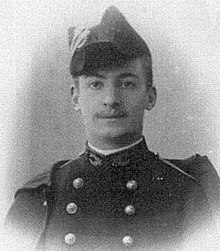

# Sistemas Lineares Triangulares
## Decomposição de Cholesky

---

<div style="width: 60%; border: 1px solid; border-radius:15px; padding:20px; position:absolute; left:10%; top: 15%;">

A decomposição de Cholesky **é a decomposição de uma matriz simétrica e definida positiva no produto de uma matriz triangular inferior e sua transposta** $(A=LL^t)$. 

Quando aplicável, a decomposição de Cholesky é aproximadamente **duas vezes mais eficiente que a decomposição LU** para resolver sistemas de equações lineares.

Foi descoberta por **André-Louis Cholesky (1875-1918)** e publicada postumamente em 1924. 

</div>

<div style="position:absolute; width:20%; border-radius:50%; right:10%; top:50%;">
    
</div>

<footer>
https://en.wikipedia.org/wiki/Cholesky_decomposition <br>
https://en.wikipedia.org/wiki/Andr%C3%A9-Louis_Cholesky
</footer>

---

## Condições para a Decomposição de Cholesky
<div style="display: flex; justify-content: space-between; gap: 20px;"> 
<div style="width: 50%; border: 0px solid; border-radius:15px;">

### Simetria:
- $A$ deve ser simétrica $(A = A^T)$.
### Positividade:
- Todos os menores principais dominantes devem ser positivos.
- Todos os autovalores devem ser positivos.

</div>
<div style="width: 50%; border: 1px solid; border-radius:15px; padding: 20px;">

***Menores Principais Dominantes***
Determinantes das submatrizes de $A$ formadas pelas primeiras $k$ linhas e colunas.

***Autovalores***
Raízes do polinômio característico de $A$, ou seja, $p(\lambda)=det(A-\lambda I)$.

</div>
</div>

<footer>
Watkins, David S. Fundamentals of matrix computations. John Wiley & Sons, 2004.
</footer>

---


<div style="display: flex; justify-content: space-between; gap: 20px;"> 
<div style="width: 50%; border: 0px solid; border-radius:15px;">

## Exercício
Verifique se a matriz $A$ é simétrica e definida positiva. 

$$
A = \begin{bmatrix}
2 & 1 & 1 \\
1 & 3 & 1 \\
1 & 1 & 2
\end{bmatrix}
$$

</div>
<div style="width: 50%; border: 1px solid; border-radius:15px; padding-left: 20px;">

#### Teorema das Raízes Racionais

Para a equação com coeficientes inteiros
$$a_nx^n + a_{n-1}x^{n-1} + \cdots + a_0 = 0,$$
qualquer raiz racional $x = \frac{p}{q}$ irredutível satisfaz:
  - **$p$** divide o termo constante $a_0$
  - **$q$** divide o coeficiente líder $a_n$

---

## Decomposição de Cholesky

### Teorema:
Dada uma matriz simétrica e definida positiva $A$, existe uma única matriz triangular inferior $L$ tal que $A = LL^T$.

#### Exemplo:
Vamos calcular a decomposição de Cholesky para a matriz $A$.

$$
A = \begin{bmatrix}
2 & 1 & 1 \\
1 & 3 & 1 \\
1 & 1 & 2
\end{bmatrix}
$$

---


## Algoritmo de Cholesky

Inicialize $L$ como uma matriz triangular inferior de zeros.
$$
\begin{eqnarray}
L_{j,j} &=& \sqrt{A_{j,j} - \sum_{k=1}^{j-1} L_{j,k}^2},\\
L_{i,j} &=& \frac{1}{L_{j,j}} \left(A_{i,j} - \sum_{k=1}^{j-1} L_{j,k} L_{i,k} \right) \quad \text{para } i > j.
\end{eqnarray}
$$

---

### Demonstração da Decomposição de Cholesky:
#### ***Existência e Unicidade***

**1. Caso $n = 1$:**

Para uma matriz $1 \times 1$, seja: $A = [a_{11}]$.
Como $A$ é definida positiva, $a_{11} > 0$, então pode definir $L = [l_{11}]$ tal que:
$$A = LL^T \implies [a_{11}] = [l_{11}] [l_{11}]^T = [l_{11}^2]$$
e, portanto, $l_{11} = \sqrt{a_{11}}$ existe e é único.

---

**2. Passo Indutivo:**

Assuma que qualquer matriz simétrica e definida positiva de ordem $k$ pode ser decomposta como $A_k = L_k L_k^T$, onde $L_k$ é triangular inferior única com entradas positivas na diagonal.

Considere agora uma matriz simétrica e definida positiva $A_{k+1}$ de ordem $k+1$:
$$A_{k+1} = \begin{bmatrix}
A_k & \mathbf{b} \\
\mathbf{b}^T & c
\end{bmatrix}$$
onde $A_k$ é uma matriz $k \times k$ simétrica e definida positiva, $\mathbf{b}$ é um vetor coluna $k \times 1$, e $c$ é um escalar positivo.

---

**3. Decomposição de $A_{k+1}$:**

Queremos $L_{k+1}$ tal que: $A_{k+1} = L_{k+1} L_{k+1}^T$, onde $L_{k+1}$ tem a forma:
$$L_{k+1} = \begin{bmatrix}
L_k & \mathbf{0} \\
\mathbf{d}^T & l_{k+1,k+1}
\end{bmatrix}$$
Multiplicando $L_{k+1} L_{k+1}^T$:
$$L_{k+1} L_{k+1}^T = \begin{bmatrix}
L_k L_k^T & L_k \mathbf{d} \\
\mathbf{d}^T L_k^T & \mathbf{d}^T \mathbf{d} + l_{k+1,k+1}^2
\end{bmatrix}$$
Comparando com $A_{k+1}$:
$$\begin{cases}
A_k = L_k L_k^T \\
\mathbf{b} = L_k \mathbf{d} \\
c = \mathbf{d}^T \mathbf{d} + l_{k+1,k+1}^2
\end{cases}$$

---

**4. Resolução para $\mathbf{d}$ e $l_{k+1,k+1}$:**

- **Encontrando $\mathbf{d}$:**
$$\mathbf{d} = L_k^{-1} \mathbf{b}$$
Como $L_k$ é triangular inferior não singular (devido a $A_k$ ser definida positiva), $\mathbf{d}$ existe e é único.

- **Encontrando $l_{k+1,k+1}$:**
$$l_{k+1,k+1} = \sqrt{c - \mathbf{d}^T \mathbf{d}}$$
Como $A_{k+1}$ é definida positiva, o menor valor de $c$ satisfaz:
$$c > \mathbf{d}^T \mathbf{d}$$
Portanto, $l_{k+1,k+1}$ é real e positivo. 

---

## Exercícios
1. Implemente a função `naive_cholesky` em C.

```c
void naive_cholesky(
  double** A, // matriz simétrica e definida positiva
  int n,      // ordem da matriz
  double** L  // matriz triangular inferior
);
```
2. Qual é a complexidade computacional da função `naive_cholesky`?

---
<!-- backgroundColor: orange -->

# PERGUNTAS?