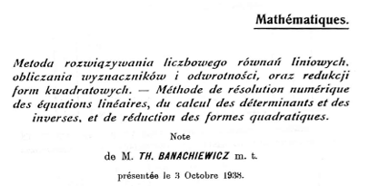

# Fatoração LU

---
## Introdução: Fatoração LU
<div style="display: flex; justify-content: space-between; gap: 20px;"> 
<div style="width: 60%; border: 0px solid; border-radius:15px;">

É uma técnica para resolver sistemas de equações lineares de tamanho "moderado".

A ideia é fatorar a matriz em $A = LU$, onde $L$ é triangular inferior e $U$ é triangular superior.

Depois, resolver dois sistemas triangulares:
  a. Resolva $Ly = b$ (foward substitution).
  b. Resolva $Ux = y$ (backward substitution).

</div>
<div style="width: 40%; border: 1px solid; border-radius:15px; padding: 5px; text-align: right;">


  
*Método para a resolução 
numérica de equações lineares, cálculo de determinantes e inversas, e redução de formas quadráticas.*

</div>
</div>

<footer style="font-size: 0.8em; color: gray; margin-top: 20px;">
Banachiewicz, T. (1938), "Méthode de résolution numérique des équations linéaires".
</footer>

---

## Definição

- Dada $A \in \mathbb{R}^{n \times n}$:
  - $L$: Triangular inferior ($l_{ij} = 0$ for $i < j$).
  - $U$: Triangular superior ($u_{ij} = 0$ for $i > j$).
- Decomposição sem pivoteamento:
  $$A = LU$$
- Decomposição com pivoteamento:
  $$PA = LU,$$
  onde $P$ é uma matriz de permutação.

---

## Algoritmo de Decomposição LU

### Sem Pivoteamento

<div style="display: flex; justify-content: space-between; gap: 20px;"> 
<div style="width: 48%; border: 1px solid; border-radius:15px;">

1. Inicialização:
   - $L$: Matriz identidade.
   - $U$: Matriz de zeros.


</div>
<div style="width: 48%; border: 1px solid; border-radius:15px;">

2. Para $k = 0$ a $n-1$:
   - Calcule a linha $k$ de $U$.
   $$u_{k,j} = a_{k,j} - \sum_{s=0}^{k-1} l_{k,s} u_{s,j}$$
   - Calcule a coluna $k$ de $L$.
     $$l_{i,k} = \frac{1}{u_{k,k}} \left( a_{i,k} - \sum_{s=0}^{k-1} l_{i,s} u_{s,k} \right)$$

</div>

---

## Computational Complexity

- **Decomposition Phase**: $O\left( \frac{2}{3}n^3 \right)$
- **Forward/Backward Substitution**: $O(n^2)$
- **Overall Complexity**: Dominated by decomposition phase.

---

## Sample Implementation in C

### LU Decomposition

```c
void luDecomposition(double** A, double** L, double** U, int n) {
    for (int k = 0; k < n; k++) {
        for (int j = k; j < n; j++) {
            U[k][j] = A[k][j];
            for (int i = 0; i < k; i++)
                U[k][j] -= L[k][i] * U[i][j];
        }
        for (int i = k + 1; i < n; i++) {
            L[i][k] = A[i][k];
            for (int j = 0; j < k; j++)
                L[i][k] -= L[i][j] * U[j][k];
            L[i][k] /= U[k][k];
        }
    }
}
