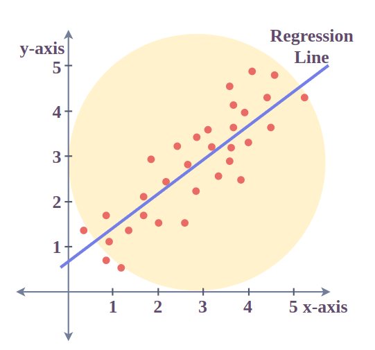
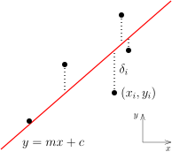
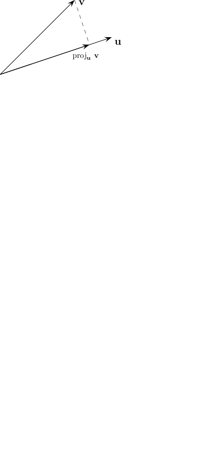
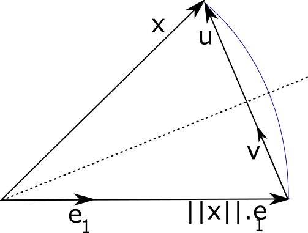

# Mínimos Quadrados
## Decomposição QR

---

## Conteúdo

1. Introdução ao Problema de Mínimos Quadrados Discreto
2. Método dos Mínimos Quadrados
3. Decomposição QR
4. Processo de Gram-Schmidt
5. Processo de Gram-Schmidt Modificado
6. Refletores de Householder
7. Prova de Ortogonalidade dos Refletores

---

## Introdução ao Problema de Mínimos Quadrados Discreto

Dado um conjunto de pontos de dados discretos $\{(t_i, y_i)\}_{i=1}^m$, o objetivo do **problema de mínimos quadrados discreto** é encontrar um polinômio $p(t)$ de grau $d$ que aproxime esses dados minimizando o erro residual.

--- 

### Formulação Matemática

O polinômio $p(t)$ pode ser expresso como:

$$
p(t) = a_0 + a_1 t + a_2 t^2 + \cdots + a_d t^d
$$

Os resíduos para cada ponto de dados são:

$$
r_i = y_i - p(t_i), \quad \text{para } i = 1, 2, \ldots, m
$$

O objetivo é minimizar a soma dos quadrados dos resíduos:

$$
\min_{a_0, a_1, \ldots, a_d} \sum_{i=1}^m (y_i - p(t_i))^2
$$

---

### Representação Matricial

Podemos reescrever o problema em termos matriciais como:

$$
\mathbf{V} \mathbf{a} \approx \mathbf{y}
$$

onde $\mathbf{a}$ é o vetor de coeficientes do polinômio $p(t)$ e $\mathbf{V}$ é a matriz de Vandermonde.

Assim, temos:

$$
\underbrace{\begin{bmatrix}
1 & t_1 & t_1^2 & \cdots & t_1^d \\
1 & t_2 & t_2^2 & \cdots & t_2^d \\
\vdots & \vdots & \vdots & \ddots & \vdots \\
1 & t_m & t_m^2 & \cdots & t_m^d \\
\end{bmatrix}}_{\text{Matriz de Vandermonde}} \begin{bmatrix}
a_0 \\
a_1 \\
\vdots \\
a_d
\end{bmatrix} \approx \begin{bmatrix}
y_1 \\
y_2 \\
\vdots \\
y_m
\end{bmatrix}
$$

---
# 2. Método dos Mínimos Quadrados

Dado um sistema sobredeterminado $A \mathbf{x} \approx \mathbf{b}$:

- $A \in \mathbb{R}^{m \times n}, m \gg n$ (mais equações do que incógnitas)
- Queremos minimizar o erro residual:
  
  $$
  \min_{\mathbf{x} \in \mathbb{R}^n} \| A \mathbf{x} - \mathbf{b} \|_2^2
  $$

A solução é dada pelas **equações normais** [1]:

$$
A^\top A \mathbf{x} = A^\top \mathbf{b},
$$

que é um sistema linear de $n$ equações e $n$ incógnitas.

[1]: Pode se demonstrar que a solução das equações normais é o ponto de mínimo global do problema de mínimos quadrados.

---

# 3. Decomposição QR

## Definição

A **decomposição QR** de uma matriz $A \in \mathbb{R}^{m \times n}$ ($m \geq n$) é a fatoração de $A$ em:

$$
A = QR
$$

onde:

- $Q \in \mathbb{R}^{m \times m}$ é uma matriz ortogonal ($Q^\top Q = I$)
- $R \in \mathbb{R}^{m \times n}$ é uma matriz triangular superior

---

## Aplicação aos Mínimos Quadrados

Substituindo $A = QR$ na equação das mínimas quadrados:

$$QR \mathbf{x} \approx \mathbf{b}$$

Multiplicando ambos os lados por $Q^\top$:

$$Q^\top QR \mathbf{x} = R \mathbf{x} = Q^\top \mathbf{b}$$

Como $R$ é triangular superior, basta aplicarmos a substituição regressiva para encontrar a solução:

$$
\mathbf{x} = R^{-1} Q^\top \mathbf{b}
$$

---

# 4. Processo de Gram-Schmidt

Seja $\{ \mathbf{a}_1, \mathbf{a}_2, \ldots, \mathbf{a}_n \} \in \mathbb{R}^m$ um conjunto LI.

1. **Primeiro vetor ortonormal:** $\mathbf{q}_1 = \frac{\mathbf{a}_1}{\| \mathbf{a}_1 \|_2}$

2. **Segundo vetor ortonormal:**

   $$
   \mathbf{q}_2 = \frac{\mathbf{a}_2 - \operatorname{proj}_{\mathbf{q}_1}(\mathbf{a}_2)}{\| \mathbf{a}_2 - \operatorname{proj}_{\mathbf{q}_1}(\mathbf{a}_2) \|_2}
   $$

3. **Generalização para o $k$-ésimo vetor:**

   $$
   \mathbf{q}_k = \frac{\mathbf{a}_k - \sum_{j=1}^{k-1} (\mathbf{q}_j^\top \mathbf{a}_k) \mathbf{q}_j}{\| \mathbf{a}_k - \sum_{j=1}^{k-1} (\mathbf{q}_j^\top \mathbf{a}_k) \mathbf{q}_j \|_2}
   $$

A projeção de $\mathbf{v}$ sobre $\mathbf{u}$ é dada por:

$$
\operatorname{proj}_{\mathbf{u}}(\mathbf{v}) = \frac{\mathbf{u}^\top \mathbf{v}}{\mathbf{u}^\top \mathbf{u}} \mathbf{u}
$$

---

# 5. Processo de Gram-Schmidt Modificado

**Diferença principal:**

- No **Gram-Schmidt clássico**, projetamos e subtraímos simultaneamente.
- No **modificado**, projetamos e subtraímos **incrementalmente**, garantindo maior ortogonalidade.

**Algoritmo: GS modificado**

Para cada vetor $\mathbf{a}_k \in \mathbb{R}^m$:

1. Inicialize $\mathbf{r}_k = \mathbf{a}_k$.
2. Para cada vetor ortonormal anterior $\mathbf{q}_j$:
   
   $$
   r_{jk} = \mathbf{q}_j^\top \mathbf{a}_k, \quad \mathbf{r}_k = \mathbf{r}_k - r_{jk} \mathbf{q}_j
   $$

3. Normalize:
   
   $$
   \mathbf{q}_k = \frac{\mathbf{r}_k}{\| \mathbf{r}_k \|_2}
   $$

---

# 6. Refletores de Householder

## Definição

Um refletor de Householder é uma matriz ortogonal $H \in \mathbb{R}^{m \times m}$ que reflete um vetor $\mathbf{x} \in \mathbb{R}^m$ em relação a um hiperplano ortogonal a um vetor $\mathbf{v} \in \mathbb{R}^m$:

$$H = I - 2 \frac{\mathbf{v} \mathbf{v}^\top}{\mathbf{v}^\top \mathbf{v}}$$

**Propriedades:**

- $H^\top H = I$ (ortogonalidade)
- $H = H^\top$ (simetria)

---

## Construção do Refletor

Para anular as entradas abaixo do primeiro elemento de um vetor $\mathbf{x} \in \mathbb{R}^m$:

1. Escolha o vetor $\mathbf{e}_1 \in \mathbb{R}^m$:
   
   $$
   \mathbf{e}_1 = \begin{bmatrix} 1 \\ 0 \\ \vdots \\ 0 \end{bmatrix}
   $$

2. Calcule $\alpha = -\text{sign}(x_1) \| \mathbf{x} \|_2$.

3. Defina $\mathbf{v} = \mathbf{x} + \alpha \mathbf{e}_1$ e normalize.
4. O refletor é dado por:
   
   $$
   H = I - 2 \frac{\mathbf{v} \mathbf{v}^\top}{\mathbf{v}^\top \mathbf{v}}
   $$

---

<!-- backgroundColor: orange -->

# PERGUNTAS?