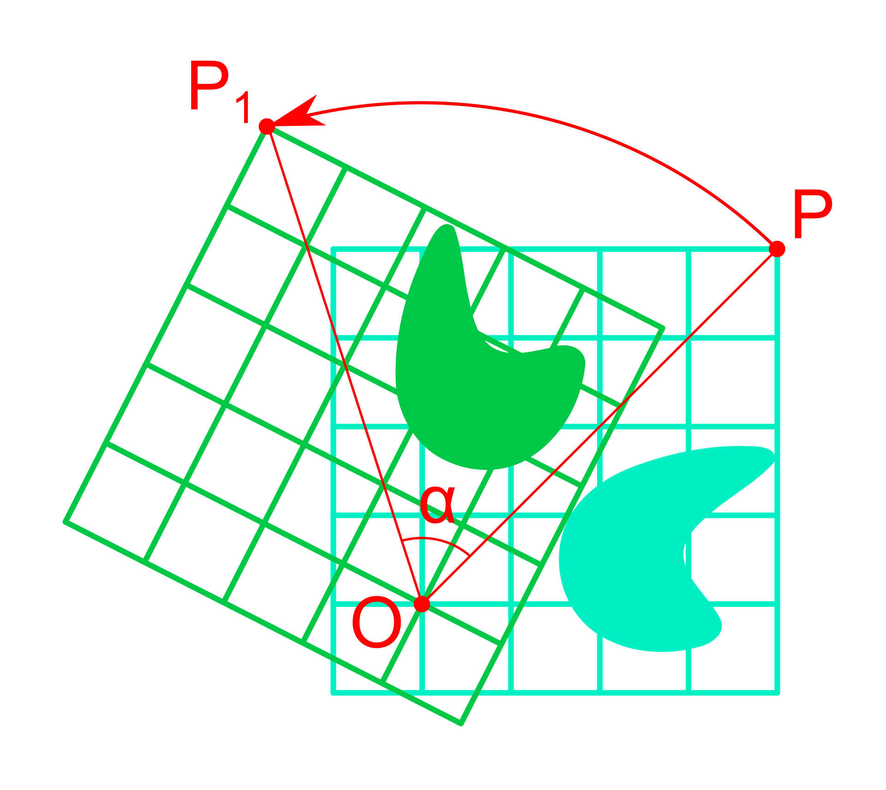

# Mínimos Quadrados
## Decomposição QR

---

## Conteúdo

1. Introdução ao Problema de Mínimos Quadrados Discreto  
2. Método dos Mínimos Quadrados  
3. Decomposição QR  
4. Processo de Gram-Schmidt (Clássico e Modificado)  
5. Refletores de Householder  
6. Rotações de Givens  

---

## Introdução ao Problema de Mínimos Quadrados Discreto

Dado um conjunto de pontos de dados discretos $\{(t_i, y_i)\}_{i=1}^m$, o objetivo do **problema de mínimos quadrados discreto** é encontrar um polinômio $p(t)$ de grau $d$ que aproxime esses dados minimizando o erro residual.

---

### Formulação Matemática

O polinômio $p(t)$ pode ser expresso como:

$$
p(t) = a_0 + a_1 t + a_2 t^2 + \cdots + a_d t^d
$$

Os resíduos para cada ponto de dados são:

$$
r_i = y_i - p(t_i), \quad \text{para } i = 1, 2, \ldots, m
$$

O objetivo é minimizar a soma dos quadrados dos resíduos:

$$
\min_{a_0, a_1, \ldots, a_d} \sum_{i=1}^m (y_i - p(t_i))^2
$$

---

### Representação Matricial

Podemos reescrever o problema em termos matriciais como:

$$
\mathbf{V} \mathbf{a} \approx \mathbf{y}
$$

onde $\mathbf{a}$ é o vetor de coeficientes do polinômio $p(t)$ e $\mathbf{V}$ é a matriz de Vandermonde.

Assim, temos:

$$
\underbrace{\begin{bmatrix}
1 & t_1 & t_1^2 & \cdots & t_1^d \\
1 & t_2 & t_2^2 & \cdots & t_2^d \\
\vdots & \vdots & \vdots & \ddots & \vdots \\
1 & t_m & t_m^2 & \cdots & t_m^d \\
\end{bmatrix}}_{\text{Matriz de Vandermonde}} 
\begin{bmatrix}
a_0 \\
a_1 \\
\vdots \\
a_d
\end{bmatrix} \approx 
\begin{bmatrix}
y_1 \\
y_2 \\
\vdots \\
y_m
\end{bmatrix}
$$

---

# Método dos Mínimos Quadrados

Dado um sistema sobredeterminado $A \mathbf{x} \approx \mathbf{b}$:

- $A \in \mathbb{R}^{m \times n}, m \gg n$ (mais equações do que incógnitas)
- Queremos minimizar o erro residual:
  
  $$
  \min_{\mathbf{x} \in \mathbb{R}^n} \| A \mathbf{x} - \mathbf{b} \|_2^2
  $$

A solução é dada pelas **equações normais** [1]:

$$
A^\top A \mathbf{x} = A^\top \mathbf{b},
$$

que é um sistema linear de $n$ equações e $n$ incógnitas.

[1]: Pode se demonstrar que a solução das equações normais é o ponto de mínimo global do problema de mínimos quadrados.

---

# Decomposição QR

## Definição

A **decomposição QR** de uma matriz $A \in \mathbb{R}^{m \times n}$ ($m \geq n$) é a fatoração de $A$ em:

$$
A = QR
$$

onde:

- $Q \in \mathbb{R}^{m \times m}$ é uma matriz ortogonal ($Q^\top Q = I$)
- $R \in \mathbb{R}^{m \times n}$ é uma matriz triangular superior

---

## Decomposição QR em Mínimos Quadrados

Substituindo $A = QR$ na equação dos mínimos quadrados:

$$
QR \mathbf{x} \approx \mathbf{b}
$$

Multiplicando ambos os lados por $Q^\top$:

$$
Q^\top QR \mathbf{x} 
= R \mathbf{x} 
= Q^\top \mathbf{b}
$$

Como $R$ é triangular superior, basta aplicarmos a substituição regressiva para encontrar a solução:

$$
\mathbf{x} = R^{-1} Q^\top \mathbf{b}
$$

---

# Processo de Gram-Schmidt (GS)

É um **algoritmo para ortogonalização**, onde **a entrada** é um conjunto de **vetores linearmente independentes** e **a saída** são **vetores ortonormais** que geram o **mesmo subespaço** que os vetores de entrada.

É baseado em **sucessivas projeções ortogonais**.

---

## Processo de Gram-Schmidt Clássico

Seja $\{ \mathbf{a}_1, \mathbf{a}_2, \ldots, \mathbf{a}_n \}$ um conjunto LI.

A projeção de $\mathbf{v}$ sobre $\mathbf{u}$ é dada por:

$$
\operatorname{proj}_{\mathbf{u}}(\mathbf{v}) 
= \frac{\mathbf{u}^\top \mathbf{v}}{\mathbf{u}^\top \mathbf{u}} \mathbf{u}
$$

1. **Primeiro vetor ortonormal:** 
   $$
   \mathbf{q}_1 = \frac{\mathbf{a}_1}{\| \mathbf{a}_1 \|_2}
   $$

2. **Segundo vetor ortonormal:**

   $$
   \mathbf{q}_2 
   = \frac{\mathbf{a}_2 - \operatorname{proj}_{\mathbf{q}_1}(\mathbf{a}_2)}{\| \mathbf{a}_2 - \operatorname{proj}_{\mathbf{q}_1}(\mathbf{a}_2) \|_2}
   $$

3. **Generalização para o $k$-ésimo vetor:**

   $$
   \mathbf{q}_k 
   = \frac{\mathbf{a}_k - \sum_{j=1}^{k-1} (\mathbf{q}_j^\top \mathbf{a}_k) \mathbf{q}_j}
          {\|\mathbf{a}_k - \sum_{j=1}^{k-1} (\mathbf{q}_j^\top \mathbf{a}_k) \mathbf{q}_j \|_2}
   $$

---

## Processo de Gram-Schmidt Modificado

**Diferença principal:**

- No **Gram-Schmidt clássico**, projetamos e subtraímos simultaneamente.
- No **modificado**, projetamos e subtraímos **incrementalmente**, garantindo maior ortogonalidade.

**Algoritmo: GS modificado**

Para cada vetor $\mathbf{a}_k \in \mathbb{R}^m$:

1. Inicialize $\mathbf{r}_k = \mathbf{a}_k$.
2. Para cada vetor ortonormal anterior $\mathbf{q}_j$:
   
   $$
   r_{jk} = \mathbf{q}_j^\top \mathbf{a}_k, 
   \quad 
   \mathbf{r}_k = \mathbf{r}_k - r_{jk} \mathbf{q}_j
   $$

3. Normalize:
   
   $$
   \mathbf{q}_k = \frac{\mathbf{r}_k}{\| \mathbf{r}_k \|_2}
   $$

---

# 6. Refletores de Householder

## Definição

Um refletor de Householder é uma matriz ortogonal $H \in \mathbb{R}^{m \times m}$ que reflete um vetor $\mathbf{x} \in \mathbb{R}^m$ em relação a um hiperplano ortogonal a um vetor $\mathbf{v} \in \mathbb{R}^m$:

$$
H = I - 2 \frac{\mathbf{v} \mathbf{v}^\top}{\mathbf{v}^\top \mathbf{v}}
$$

**Propriedades:**

- $H^\top H = I$ (ortogonalidade)
- $H = H^\top$ (simetria)

---

## Proposição: A matriz de Householder é ortogonal

Precisamos mostrar que $H^T H = I$.

A matriz de Householder é definida como:

$$
H = I - 2 \frac{\mathbf{v} \mathbf{v}^T}{\mathbf{v}^T \mathbf{v}}
$$

onde $\mathbf{v}$ é um vetor.

Primeiro, observe que $H$ é simétrica:

$$
H^T 
= \left( I - 2 \frac{\mathbf{v} \mathbf{v}^T}{\mathbf{v}^T \mathbf{v}} \right)^T 
= I - 2 \frac{\mathbf{v} \mathbf{v}^T}{\mathbf{v}^T \mathbf{v}} 
= H
$$

---

Finalmente, calcule $H^T H$:

$$
\begin{align}
H^T H 
&= \left( I - 2 \frac{\mathbf{v} \mathbf{v}^T}{\mathbf{v}^T \mathbf{v}} \right) 
   \left( I - 2 \frac{\mathbf{v} \mathbf{v}^T}{\mathbf{v}^T \mathbf{v}} \right) \\
&= I 
   - 2 \frac{\mathbf{v} \mathbf{v}^T}{\mathbf{v}^T \mathbf{v}} 
   - 2 \frac{\mathbf{v} \mathbf{v}^T}{\mathbf{v}^T \mathbf{v}} 
   + 4 \frac{\mathbf{v} \mathbf{v}^T \mathbf{v} \mathbf{v}^T}{(\mathbf{v}^T \mathbf{v})^2} \\
&= I 
   - 4 \frac{\mathbf{v} \mathbf{v}^T}{\mathbf{v}^T \mathbf{v}} 
   + 4 \frac{\mathbf{v} (\mathbf{v}^T \mathbf{v}) \mathbf{v}^T}{(\mathbf{v}^T \mathbf{v})^2} \\
&= I 
   - 4 \frac{\mathbf{v} \mathbf{v}^T}{\mathbf{v}^T \mathbf{v}} 
   + 4 \frac{\mathbf{v} \mathbf{v}^T}{\mathbf{v}^T \mathbf{v}} 
= I
\end{align}
$$

---

# 7. Householder QR

As reflexões de Householder podem ser aplicadas na decomposição $QR$.

O processo envolve a construção iterativa de matrizes de Householder para introduzir zeros abaixo da diagonal principal, transformando $A$ em $R$.

O produto dessas matrizes de Householder forma a matriz ortogonal $Q$.

$$
\underbrace{H_n H_{n-1} \cdots H_1}_{\text{Matrizes de Householder}} A = R
$$

---

### Ideia Central

Suponha que desejamos refletir um vetor $\mathbf{x} \in \mathbb{R}^n$ de modo que ele se alinhe com um múltiplo do primeiro vetor base padrão $\mathbf{e}_1 = [1, 0, 0, \ldots, 0]^T$.

1. **Calcule a norma de $\mathbf{x}$**:

   $$
   \|\mathbf{x}\| = \sqrt{x_1^2 + x_2^2 + \cdots + x_n^2}
   $$

2. **Determine o escalar $\alpha$**:

   $$
   \alpha = -\operatorname{sign}(x_1) \cdot \|\mathbf{x}\|
   $$

3. **Construa o vetor $\mathbf{v}$**:

   $$
   \mathbf{v} = \mathbf{x} - \alpha \mathbf{e}_1
   $$

4. **Normalize $\mathbf{v}$**:

   $$
   \mathbf{v} = \frac{\mathbf{v}}{\|\mathbf{v}\|}
   $$

- A matriz de Householder resultante é $H = I - 2\mathbf{v}\mathbf{v}^T.$
- $H\mathbf{x}$ é um vetor com zeros em todas as componentes, exceto a primeira.

---

## Proposição: $Hx = \alpha e_1$

Sabendo que 

$$
Hx = x - 2 \frac{v^T x}{v^T v} v
\quad\text{ e }\quad
\alpha^2 = \|x\|^2,
$$

vamos calcular $v^T x$ e $v^T v$:

$$
\begin{align}
v^T x 
&= (x - \alpha e_1)^T x \\
&= \|x\|^2 - \alpha x_1, \\
v^T v 
&= (x - \alpha e_1)^T (x - \alpha e_1) \\
&= \|x\|^2 - 2 \alpha x_1 + \alpha^2 \\
&= \|x\|^2 - 2 \alpha x_1 + \|x\|^2 \\
&= 2 (\|x\|^2 - \alpha x_1).
\end{align}
$$

---

Agora, fazendo as substituições na expressão para $Hx$, temos:

$$
\begin{align}
Hx 
&= x 
   - 2 \frac{\|x\|^2 - \alpha x_1}{2 (\|x\|^2 - \alpha x_1)} (x - \alpha e_1) 
\\
&= x - (x - \alpha e_1) 
\\
&= \alpha e_1
\end{align}
$$

Portanto, para $v = x - \operatorname{sign}(x_1) \|x\| e_1$, a matriz de Householder $H$ satisfaz $Hx = \|x\| e_1$.

---

### Ideia Central (continuação)

Para aplicar sucessivamente as reflexões de Householder e reduzir a matriz $A$ a uma forma triangular superior, seguimos o seguinte procedimento:

1. Inicialmente, aplicamos a primeira reflexão de Householder $H_1$ à matriz completa $A$, zerando os elementos abaixo do primeiro elemento da primeira coluna. A matriz $H_1$ é da mesma dimensão de $A$.

$$
H_1 A 
= \begin{bmatrix} * & * & * \\ 0 & * & * \\ 0 & * & * \end{bmatrix}
$$

---

### Ideia Central (continuação)

2. Depois, excluímos a primeira linha e a primeira coluna de $A$ e construímos a matriz de Householder $H_2$ para zerar os elementos abaixo do primeiro elemento dessa submatriz. Aplicamos 

$$
\underbrace{\begin{bmatrix} 1 & 0 & 0  \\ 0 & * & * \\ 0 & * & * \end{bmatrix}}_{H_2} 
H_1 A 
= \begin{bmatrix} * & * & * \\ 0 & * & * \\ 0 & 0 & * \end{bmatrix}
$$

3. Esse processo é repetido sucessivamente para submatrizes menores, até que todos os elementos abaixo da diagonal principal de $A$ sejam zerados.

---

# 8. Rotações de Givens

## Definição

Uma **rotação de Givens** é uma transformação ortogonal elementar que atua em um plano bidimensional específico de $\mathbb{R}^m$. A ideia é aplicar uma rotação em torno de um eixo de forma a anular (ou "zerar") um elemento específico de um vetor ou de uma coluna de uma matriz.

---

Por exemplo, para anular o elemento $(4,2)$ de uma matriz $5 \times 5$, podemos usar a matriz de rotação de Givens:

$$
G(2,4,\theta) = \begin{bmatrix}
1 & 0 & 0 & 0 & 0 \\
0 & c & 0 & -s & 0 \\
0 & 0 & 1 & 0 & 0 \\
0 & s & 0 & c & 0 \\
0 & 0 & 0 & 0 & 1
\end{bmatrix},
$$

com $c = \cos(\theta)$ e $s = \sin(\theta)$ para um ângulo $\theta$ convenientemente escolhido.

**Determinando $\theta$**

$$
\begin{bmatrix}
c & -s \\
s & \;\;c
\end{bmatrix}
\begin{bmatrix}
a_{2,2} \\
a_{4,2}
\end{bmatrix}
=
\begin{bmatrix}
r \\
0
\end{bmatrix}
$$

com 

$$
\begin{align}
r 
&= \sqrt{a_{2,2}^2 + a_{4,2}^2} \\
c 
&= \frac{a_{2,2}}{r} \quad \text{e} \quad s = -\frac{a_{4,2}}{r}
\end{align}
$$

Com esta escolha mantemos a norma do vetor original e $c^2 + s^2 = 1$.

---

## Forma Geral

$$
G(i,j,\theta) = \begin{bmatrix}
1 & 0 & 0 & \cdots & 0 & 0 & 0 \\
0 & c & 0 & \cdots & 0 & -s & 0 \\
0 & 0 & 1 & \cdots & 0 & 0 & 0 \\
\vdots & \vdots & \vdots & \ddots & \vdots & \vdots & \vdots \\
0 & 0 & 0 & \cdots & 1 & 0 & 0 \\
0 & s & 0 & \cdots & 0 & c & 0 \\
0 & 0 & 0 & \cdots & 0 & 0 & 1
\end{bmatrix}
$$

## Propriedades

1. **Ortogonalidade**: $G^T G = I$.  
2. **Determinante**: $\det(G) = 1$, pois é uma rotação (sem reflexão).  
3. **Esparsidade**: Uma rotação de Givens difere da identidade apenas nas linhas e colunas $i$ e $j$.

---

## Aplicação na Decomposição QR

Para calcular a decomposição QR de uma matriz $A \in \mathbb{R}^{m \times n}$ via rotações de Givens:

1. **Percorre-se cada coluna $k = 1, 2, \ldots, n$**:
   - Para cada linha $i$ da coluna $k$ (abaixo da diagonal), aplica-se uma rotação de Givens para zerar $a_{i,k}$:
     1. Identifique o par $(k, i)$ onde $k < i$.  
     2. Compute $\theta$ (ou diretamente $c$ e $s$) para anular $a_{i,k}$.  
     3. Multiplique $A$ por $G(i, k, \theta)$ pela **esquerda**.

2. **Acumula-se as rotações** $G_1, G_2, \dots$ para formar a matriz ortogonal $Q$. Então:
   $$
   G_p \cdots G_2 G_1 \, A = R \quad \Rightarrow \quad Q^T A = R,
   $$
   onde $Q = (G_p \cdots G_2 G_1)^T$.

---

## Comparação: Householder vs. Givens

- **Householder**  
  - Boa para matrizes densas: cada refletor zera vários elementos simultaneamente em uma coluna.  
  - Menos eficiente para matrizes esparsas: a reflexão pode preencher muitas posições que antes eram zeros.  

- **Givens**  
  - Adequada para matrizes esparsas ou quando se deseja realizar o método de forma **incremental** (por exemplo, ao inserir linhas uma a uma).  
  - Cada rotação zera um único elemento. Pode ser mais lenta que Householder para matrizes densas, pois são necessárias muitas rotações.

---

# Exercícios:

1. Para a matriz abaixo, obtenha a decomposição QR utilizando os seguintes métodos:
$$
A
= \begin{bmatrix}
6 & 0 & 2 & 1 \\
0 & 5 & 3 & 2 \\
0 & 0 & 7 & 3 \\
2 & 0 & 3 & 4
\end{bmatrix}.
$$

$\quad\quad$ (a) Gram-Schmidt clássico.
$\quad\quad$ (b) Gram-Schmidt modificado.
$\quad\quad$ (c) Householder.
$\quad\quad$ (d) Givens.

---

2. Compare o número de operações entre o uso de refletores de Householder e o uso de rotações de Givens da matriz do exercício anterior.

3. Construa a matriz de Hilbert $6 \times 6$.
   (a) Aplique a decomposição QR utilizando Gram-Schmidt clássico, Gram-Schmidt modificado, Householder e Givens.
   (b) Compare a precisão da decomposição QR dos quatro métodos.

---

<!-- backgroundColor: orange -->
# PERGUNTAS?
