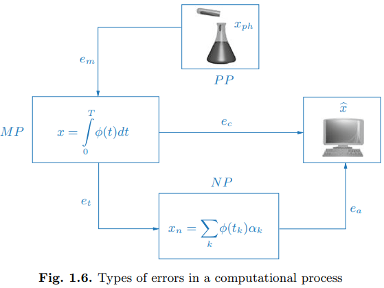

# Sensibilidade de Sistemas Lineares
## Efeitos dos Erros de Arredondamento

---
<div style="position: fixed; top: 20px; width: 100%; background-color: white; z-index: 1000;">
<h2 style="text-align: left;">Errar não é só humano</h2>
</div>

<div style="margin-top: 60px;">
<div style="display: flex; align-items: flex-start; gap: 20px;">

<div>

1. **Erro do Modelo** ($e_m$)  
  Ocorre ao simplificar a realidade física ($PP$) em um modelo matemático ($MP$). Está além do controle computacional.

</div>
</div>
</div>

<footer>
Quarteroni, Alfio, Fausto Saleri, and Paola Gervasio. Scientific computing with MATLAB and Octave. Vol. 3. Berlin: Springer, 2006.
</footer>

---
<div style="position: fixed; top: 20px; width: 100%; background-color: white; z-index: 1000;">
<h2 style="text-align: left;">Errar não é só humano</h2>
</div>

<div style="margin-top: 60px;">
<div style="display: flex; align-items: flex-start; gap: 20px;">

<div>

2. **Erro Algorítmico** ($e_a$)  
  Erros introduzidos durante a resolução computacional do modelo matemático, principalmente devido a arredondamentos na representação numérica.

</div>
</div>
</div>

<footer>
Quarteroni, Alfio, Fausto Saleri, and Paola Gervasio. Scientific computing with MATLAB and Octave. Vol. 3. Berlin: Springer, 2006.
</footer>

---

<div style="position: fixed; top: 20px; width: 100%; background-color: white; z-index: 1000;">
<h2 style="text-align: left;">Errar não é só humano</h2>
</div>

<div style="margin-top: 60px;">
<div style="display: flex; align-items: flex-start; gap: 20px;">

<div>

3. **Erro de Truncamento** ($e_t$)  
   Erros introduzidos ao aproximar sequências infinitas por operações finitas. Ocorre quando a solução numérica ($x_n$) difere da solução exata ($x$).

</div>
</div>
</div>

<footer>
Quarteroni, Alfio, Fausto Saleri, and Paola Gervasio. Scientific computing with MATLAB and Octave. Vol. 3. Berlin: Springer, 2006.
</footer>

---

<div style="position: fixed; top: 20px; width: 100%; background-color: white; z-index: 1000;">
<h2 style="text-align: left;">Errar não é só humano</h2>
</div>

<div style="margin-top: 60px;">
<div style="display: flex; align-items: flex-start; gap: 20px;">

<div>

4. **Erro Computacional** ($e_c$)  
   O erro total que surge a partir da soma do erro algorítmico ($e_a$) e do erro de truncamento ($e_t$). 
   
   Este é o erro de interesse ao resolver problemas numéricos.

</div>
</div>
</div>

<footer>
Quarteroni, Alfio, Fausto Saleri, and Paola Gervasio. Scientific computing with MATLAB and Octave. Vol. 3. Berlin: Springer, 2006.
</footer>

---

<div style="display: flex; justify-content: space-between; gap: 20px;">
<div style="flex: 1; padding: 0px;">

## Precisão Numérica
A precisão numérica é afetada pela ***ordem das operações aritméticas*** (pelo algoritmo). 

Como ilustração, suponha uma máquina com dois algarismos significativos e que desejamos calcular

$$1 + \epsilon + \epsilon + \ldots + \epsilon,$$

onde $\epsilon=3.0 \times 10^{-2}$ e que tenhamos $n=11$ parcelas.

  </div>
  <div style="flex: 1; border: 1px solid black; padding: 20px; border-radius: 10px;">
    <h6>Algoritmo Ingênuo de Soma </h6>

```python
s = 0
for i in range(n):
  s += epsilon
```
   
<h6>Algoritmo de Soma de Kahan</h6>

```python
s = 0
c = 0
for i in range(n):
  # y : parcela + compensação
  y = epsilon - c
  # soma efetiva
  t = s + y       
  # c : erro de arredondamento
  c = (t - s) - y 
  s = t
```
  </div>
</div>

---

## Algoritmo de Soma de Kahan

<div style="font-size: 0.9em; display: flex; justify-content: center;">

$k$ | $y = \epsilon - c$ | $t = s + y$ | $c = (t - s) - y$ | $s = t$
|:-:|:-:|:-:|:-:|:-:|
1| $3.0 \times 10^{-2}$ | $1.0$ | $(1.0 - 0.0) - 3.0 \times 10^{-2} = -3.0 \times 10^{-2}$ | $1.0$ |
2| $6.0 \times 10^{-2}$ | $1.0$ | $(1.0 - 0.0) - 6.0 \times 10^{-2} = -3.0 \times 10^{-2}$ | $1.0$ |
3| $9.0 \times 10^{-2}$ | $1.0$ | $(1.0 - 0.0) - 9.0 \times 10^{-2} = -6.0 \times 10^{-2}$ | $1.0$ |
4| $1.2 \times 10^{-1}$ | $1.1$ | $(1.1 - 1.0) - 1.2 \times 10^{-2} = -2.0 \times 10^{-2}$ | $1.1$ |
5| $5.0 \times 10^{-2}$ | $1.1$ | $(1.1 - 1.1) - 5.0 \times 10^{-2} = -5.0 \times 10^{-2}$ | $1.1$ |
6| $8.0 \times 10^{-2}$ | $1.1$ | $(1.1 - 1.1) - 8.0 \times 10^{-2} = -8.0 \times 10^{-2}$ | $1.1$ |
7| $1.1 \times 10^{-1}$ | $1.2$ | $(1.2 - 1.1) - 1.1 \times 10^{-1} = -1.0 \times 10^{-2}$ | $1.2$ |

</div>

---

## Caso de estudo

Para a matriz $A$, calcule a solução dos sistemas lineares $Ax = b$ e $A\hat{x} = \hat{b}$ onde
$$A = \begin{bmatrix} 1000 & 999 \\ 999 & 998 \end{bmatrix}, \quad b = \begin{bmatrix} 1999 \\ 1998 \end{bmatrix} \quad \text{e} \quad \hat{b} = \begin{bmatrix} 1999 \\ 1998.001 \end{bmatrix}.$$

Escrevendo $\hat{x} = x + \delta x$ e $\hat{b} = b + \delta b$, compare as variações relativas $\Large{\frac{\delta x}{x}}$ e $\Large{\frac{\delta b}{b}}$.

---

## Norma de um vetor

**Uma norma** (ou **norma vetorial**) em $\mathbb{R}^n$ é uma função que atribui a cada $x \in \mathbb{R}^n$ um número real não-negativo $\|x\|$, tal que para todos $x, y \in \mathbb{R}^n$ e todos $\alpha \in \mathbb{R}$:

1. **Positividade**
$\|x\| \geq 0$ para todo $x$, e $\|x\| = 0$ se e somente se $x = 0$ 

2. **Homogeneidade absoluta**
$\|\alpha x\| = |\alpha| \|x\|$ 

3. **Desigualdade triangular**
$\|x + y\| \leq \|x\| + \|y\|$ 

---

## Exemplos

1. Norma euclidiana
$$||x||_2 = \sqrt{x_1^2 + x_2^2 + \cdots + x_n^2}$$

2. Norma de Manhattan (ou *norma do valor absoluto* ou *norma 1*)
$$||x||_1 = |x_1| + |x_2| + \cdots + |x_n|$$

3. Norma infinita
$$||x||_\infty = \max(|x_1|, |x_2|, \cdots, |x_n|)$$

4. Norma $p$
$$||x||_p = \left( \sum_{i=1}^n |x_i|^p \right)^{1/p}$$

---

## Norma de uma matriz

Para todos $A,B \in \mathbb{R}^{n \times n}$ e $\alpha \in \mathbb{R}$:

1. **Positividade**
$\|A\| \geq 0$ para todo $A$, e $\|A\| = 0$ se e somente se $A = 0$ 

2. **Homogeneidade absoluta**
$\|A\alpha\| = |\alpha| \|A\|$ 

3. **Desigualdade triangular**
$\|A + B\| \leq \|A\| + \|B\|$ 

<span style="color: blue;">

4. **Submultiplicatividade** 
$\|AB\| \leq \|A\| \|B\|$ 

</span>

---

## Exemplos

1. Norma de Frobenius
$$||A||_F = \sqrt{\sum_{i=1}^n \sum_{j=1}^n a_{ij}^2}$$

2. Norma de Schatten $p$
$$||A||_p = \left( \sum_{i=1}^n \sigma_i^p \right)^{1/p},$$
onde $\sigma_i$ são os valores singulares de $A$.

---

## Norma Matricial Induzida

Seja $A \in \mathbb{R}^{n \times n}$. A norma induzida por uma norma vetorial $\| \cdot \|$ é definida como
$$||A|| = \max_{x \neq 0} \frac{||Ax||}{||x||}.$$

*A norma induzida mede a amplificação máxima de um vetor $x$ por uma matriz $A$.*

---

## Teorema 2.1.26
A norma matricial induzida é uma norma matricial.

## Teorema 2.1.24

Uma norma vetorial e sua norma matricial induzida satisfazem a desigualdade 

$$||Ax|| \leq ||A||\,||x||$$

para todo $A \in \mathbb{R}^{n \times n}$ e $x \in \mathbb{R}^n$. 

Além disso, sempre existe um vetor $x$ tal que $||Ax|| = ||A||\,||x||.$

---

## Retornando ao caso de estudo

1. $Ax=b$ e $A(x+\delta x)=b + \delta b$ implica em $A\delta x = \delta b$, portanto $\delta x = A^{-1} \delta b$.

2. Uma vez que $||Az|| \leq ||A||\,||z||$ para todo $z \in \mathbb{R}^n$, temos
  2.1 $||\delta x|| \leq ||A^{-1}||\,||\delta b||.$
  2.2 $||b|| \leq ||A||\,||x|| \Longrightarrow ||x|| \geq \Large{\frac{||b||}{||A||}}.$

Portanto,

$$\frac{||\delta x||}{||x||} \leq ||A||\,||A^{-1}|| \frac{|| \delta b ||}{||b||}.$$

---

## Número de Condição

Seja $A$ uma matriz não singular. O número de condição de $A$ é definido como
$$\kappa(A) = ||A|| ||A^{-1}||.$$

1. *O número de condição mede a sensibilidade da solução de um sistema linear às variações dos dados.* 

2. *Em um sistema linear com número de condição alto, pequenas variações nos dados podem causar grandes variações na solução.*


**Retornando ao caso de estudo...**

Calcule o número de condição da matriz $A$ para a norma de Frobenius.

---

## Exemplo: Matrizes de Hilbert

Um dos exemplos mais famosos de matrizes mal condicionadas são as **matrizes de Hilbert**, definidas por $h_{ij} = 1 / (i + j - 1)$. 


Essas matrizes são simétricas, podem ser mostradas como positivas definidas e se tornam cada vez mais mal condicionadas à medida que $n$ aumenta. Por exemplo,  $\kappa_2(H_4) \approx 1.6 \times 10^4$ e $\kappa_2(H_8) \approx 1.5 \times 10^{10}$.

$$
H_4 = 
\begin{bmatrix}
1 & 1/2 & 1/3 & 1/4 \\
1/2 & 1/3 & 1/4 & 1/5 \\
1/3 & 1/4 & 1/5 & 1/6 \\
1/4 & 1/5 & 1/6 & 1/7
\end{bmatrix},
$$

---
<!-- backgroundColor: orange -->

# PERGUNTAS?