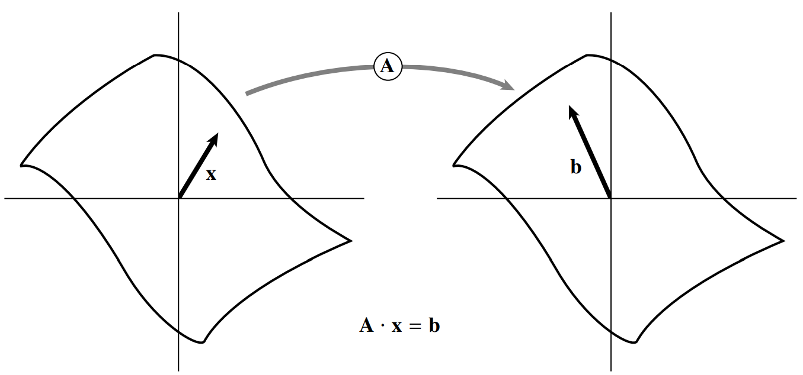
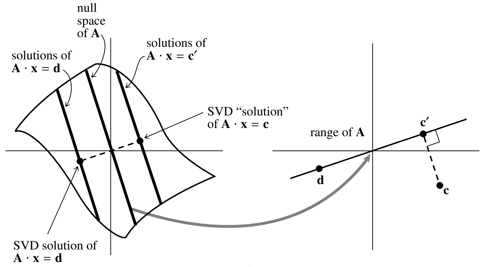
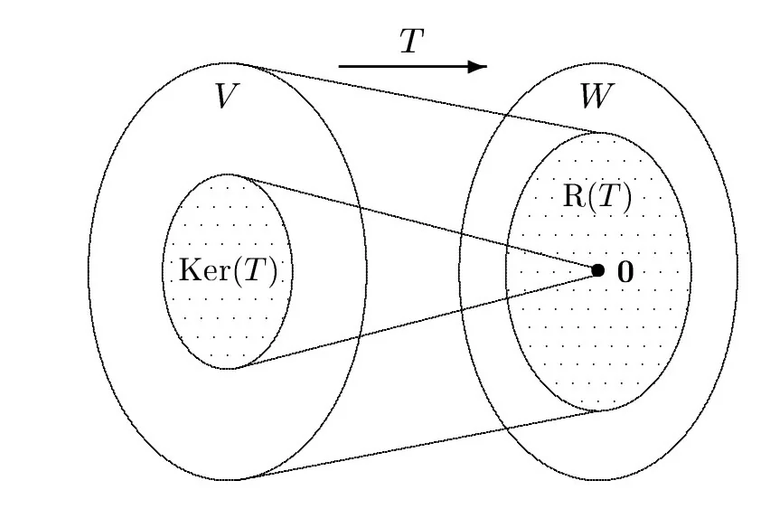

# Decomposição em Valores Singulares
## *Singular Value Decomposition (SVD)*

---

### Construção de uma base ortonormal

Suponha que você tenha um conjunto de $V=\{v_1, \ldots, v_n\}$ de vetores independentes em um espaço vetorial de dimensão $m$, com $n \leq m$.

Você quer construir um conjunto $U=\{u_1, \ldots, u_n\}$ tal que 

$$span (U) = span (V).$$ 

Podemos utilizar Gram-Schmidt, mas ele é muito ruim devido à acumulação de erros de arredondamento.

A maneira correta de resolver este problema é pela SVD.

<footer>
Press, William H. Numerical recipes 3rd edition: The art of scientific computing. Cambridge university press, 2007.
</footer>

---

Uma **matriz não singular $A$** mapeia um espaço vetorial em outro de mesma dimensão. O vetor $x$ é mapeado em $b$, de forma que $x$ satisfaz a equação $A x = b$.

<footer>
Press, William H. Numerical recipes 3rd edition: The art of scientific computing. Cambridge university press, 2007.
</footer>

---

Uma **matriz singular $A$** mapeia um espaço vetorial em outro de dimensão menor. Aqui, o plano é mapeado em uma linha. 

<footer>
Press, William H. Numerical recipes 3rd edition: The art of scientific computing. Cambridge university press, 2007.
</footer>

---

### Range (Imagem)
Seja $A$ uma matriz $m \times n$. O **range** de $A$ é o conjunto de todos os vetores $b$ que podem ser escritos como $A x$ para algum $x \in \mathbb{R}^n$.

### Null Space (Núcleo)
Seja $A$ uma matriz $m \times n$. O **null space** de $A$ é o conjunto de todos os vetores $x \in \mathbb{R}^n$ tais que $A x = 0$.

### Rank (Posto)
O **rank** de $A$ é o número de linhas (ou colunas) linearmente independentes de $A$.

---

### Teorema 4.1.1 (SVD)

Seja $A$ uma matriz não-nula $m \times n$ com rank (posto) $r$. Então, $A$ pode ser expressa como um produto de três matrizes:

$$A = U \Sigma V^T,$$

onde $U \in \mathbb{R}^{m \times m}$ e $V \in \mathbb{R}^{n \times n}$ são matrizes ortogonais, e $\Sigma \in \mathbb{R}^{m \times n}$ é uma matriz diagonal com entradas não-negativas na diagonal.

$$
\Sigma = \begin{bmatrix}
\sigma_1 &  & & \\
& \sigma_2 & & \\
& & \ddots & \\
& & & \sigma_r \\
& & & & 0\\
& & & & & \ddots\\
\end{bmatrix},
$$
com $\sigma_1 \geq \sigma_2 \geq \cdots \geq \sigma_r > 0$

---

Uma matriz $A \in \mathbb{R}^{m \times n}$ mapeia vetores $x\in\mathbb{R}^n$ em vetores $Ax\in\mathbb{R}^m$.

O Teorema 4.1.1 afirma que existe uma base ortonormal $\{v_1,\ldots,v_n\}$ de $\mathbb{R}^n$ e uma base ortonormal $\{u_1,\ldots,u_m\}$ de $\mathbb{R}^m$ tais que

$$A v_i = \sigma_i u_i, \quad i=1,\ldots,r,$$

com $\sigma_1 \geq \sigma_2 \geq \cdots \geq \sigma_r > 0$.

Os escalares (números) $\sigma_i$ são os valores singulares de $A$ e os vetores $u_i$ e $v_i$ são os vetores singulares de $A$.

---

## Consequências SVD
$$
\begin{aligned}
range(A) &= span\{u_1, \ldots, u_r\} \\
null(A) &= span\{v_{r+1}, \ldots, v_n\} \\
range(A^T) &= span\{v_1, \ldots, v_r\} \\
null(A^T) &= span\{u_{r+1}, \ldots, u_m\} \\
\end{aligned}
$$

### Teorema: Núcleo e Imagem
Seja $A$ uma matriz $m \times n$. Então,

$$
\text{dim}(\text{range}(A)) + \text{dim}(\text{null}(A)) = m.
$$

---

<!-- backgroundColor: orange -->

# PERGUNTAS?